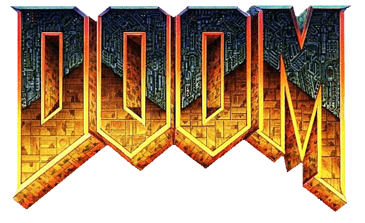
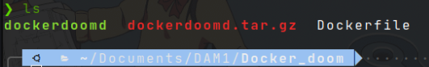
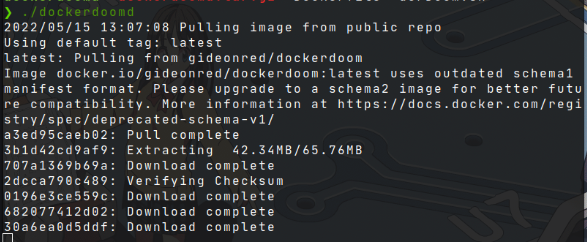
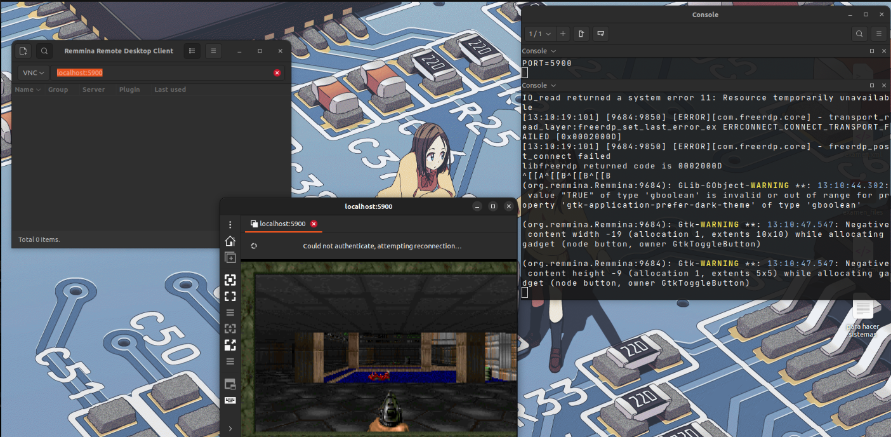

#  **Docker** 

En anteriores trabajos ya habíamos explicado  e instalado Docker. Una de las funcionalidades de Docker es la capacidad de levantar contenedores  livianos que ejecutan procesos de manera aislada. 

Ahora en esta práctica se pretende poner en marcha *DOOM* dentro de un contenedor para afianzar estos conceptos. 

## **Pasos a seguir**  

### **Paso 1** 

Se descarga el archivo binario que se encuentra aquí: 
[Archivo binario necesario](https://web.archive.org/web/20160310005603/https://gideonred.com/bins/dockerdoomd.tar.gz)

Se descargará un archivo con la extención `.tar.gz`, dicho archivo lo descomprimimos en una carpeta con el siguiente comando: 

```bash
tar -xf dockerdoomd.tar/gz
```

Ahora tendremos en el directorio 2 archivos más: 



### **Paso 2**

Ahora iniciamos algunos contenedores de Docker con el siguiente comando:

```bash
for i in {1..n} ; do docker run -d -t ubuntu:14.04; done
```

En mi caso he iniciado 2 contenedores por lo que el comando anterior quedará así: 

```bash
for i in {1..2} ; do docker run -d -t ubuntu:14.04; done
```

Ahora iniciamos el binario de Docker anteriormente descargado: 

```bash
sudo ./dockerdoomd
```

Nos deberá aparecer algo parecido a esto: 



### Paso 3 

Para el siguiente paso se necesita una conexión VCN tcp, que permite la conexión de DOOM y cualquier computadora en la que se desee que se muestre. Las conexiones VCN utilizan el protocolo RFB  (remote framebuffer o búfer de fotogramas remoto por su traducción). 

Para ello nos descargamos el cliente remoto de escritorio [Remmina](https://remmina.org/), seguimos los pasos para descargarlos que se encuentran en su web. En mi caso (Ubuntu 22.04) deberé seguir los siguientes pasos: 

```bash
sudo apt-add-repository ppa:remmina-ppa-team/remmina-next
```

```bash
sudo apt update
```

```bash
sudo apt install remmina remmina-plugin-rdp remmina-plugin-secret
```

### Paso 4

Ahora abrimos Remmina e indicamos que usaremos el servicio  VNC con `localhost:5900`. A continuación nos pedirá una contraseña que será `1234`. 

Nos aparecera una ventana con el juego, esto significará que hemos hecho todo correctamente. 




### Referencias

[Repositorio dockerdoomd](https://github.com/GideonRed/dockerdoomd)

[Remmina](https://remmina.org/)